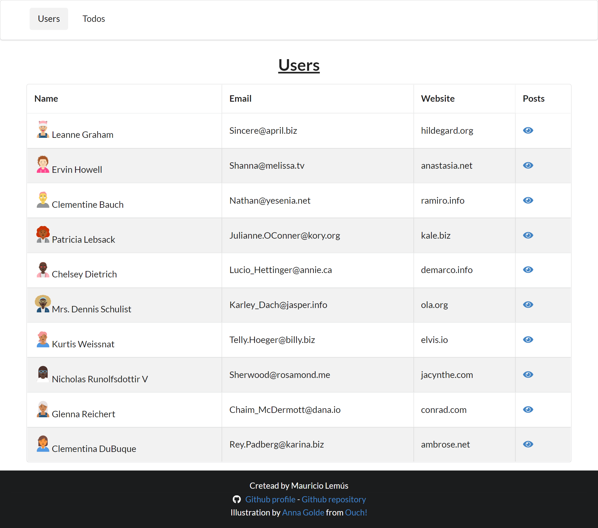

# Mini Blog App

Es un sitio web en la cual se listan usuarios, publicaciones y tareas, para ello se utilizo la API de JSON Placeholder la cual es una API de prueba por lo que todas las solicitudes POST, PUT Y DELETE no se llevan a cabo realmente.
El sitio se creo a manera de practica para aplicar los conceptos de Redux.

## Proyecto
[Deploy 🚀](https://nifty-beaver-ee0362.netlify.app/)

## Funcionalidades

- [x] Listar usuarios.
- [x] Listar publicaciones de cada usuario.
- [x] Listar los comentarios de cada publicación.
- [x] Listar todas las tareas de cada usuario.
- [x] Crear nuevas tareas (la inserción no se lleva a cabo realmente).
- [x] Eliminar tareas (la eliminación no se lleva a cabo realmente).
- [x] Editar tareas (la edición no se lleva a cabo realmente).


## Tecnologias utilizadas
- [React](https://es.reactjs.org/)
- [Redux](https://es.redux.js.org/)
- [Typescript](https://www.typescriptlang.org/)
- [Semantic UI ](https://react.semantic-ui.com/)
- [Sass](https://sass-lang.com/)

## Instalación y uso

Clonar el repositorio:
```
git clone https://github.com/JMauricio22/mini-blog-redux.git
```

Instalar dependencias:
```
npm install
```
Ejecutar la aplicación:
```
npm run start
```

## Contacto
- [Github @JMauricio22](https://github.com/JMauricio22)
